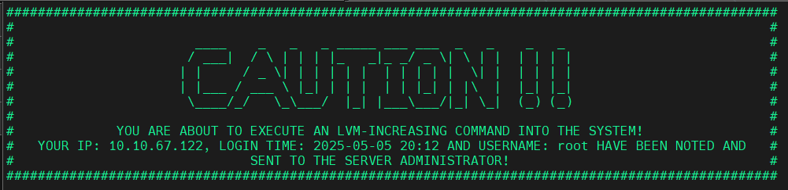
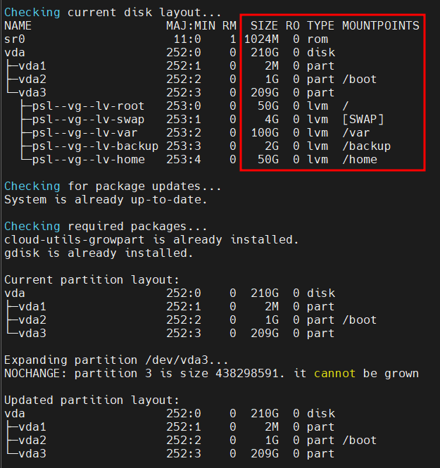
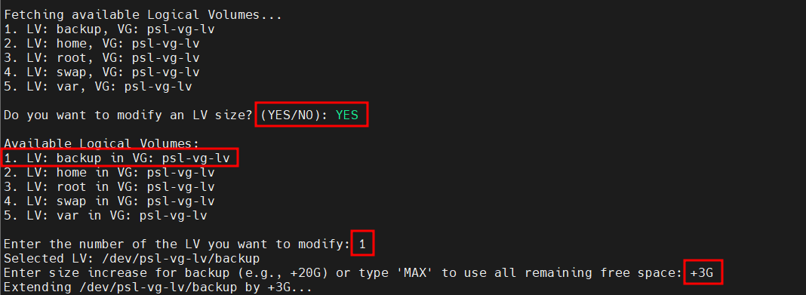
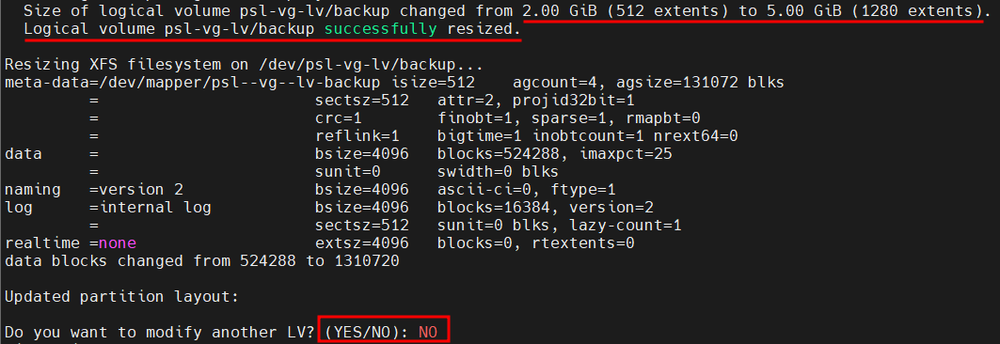
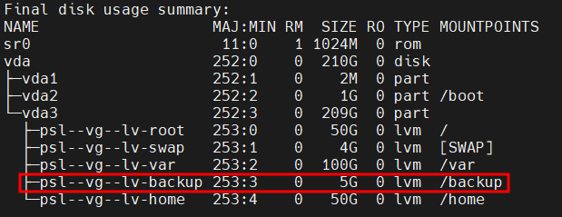

# 🚀 Expand-LVM-Alma_Linux-9.5.sh


[](./LICENSE)


[](https://github.com/adibakhtab007/shell_script/stargazers)
[](https://github.com/adibakhtab007/shell_script/network)

A powerful, interactive Bash script to **safely and automatically expand Logical Volumes (LVs)** on AlmaLinux 9.5 systems. Designed for system administrators who need quick, reliable, and user-guided LVM expansion—without missing critical steps.

---

## ✨ Key Features

- ⚠️ **Smart warning & audit info** – Logs username, IP, and login time.
- 🧰 **Auto-checks and installs required tools** – Ensures `growpart`, `gdisk`, and more are present.
- 💾 **Partition growth via `growpart`** – Automatically expands `/dev/vda3`.
- 📈 **Dynamic LV selection interface** – Lists all Logical Volumes in real time.
- ➕ **Flexible size input** – Use `+SIZE` format or `MAX` to allocate all free space.
- 🧠 **Auto-detects filesystem types** – Supports `xfs`, `ext4`, and `swap` with appropriate resizing tools.
- 🔄 **Multi-cycle support** – Resize multiple LVs in one session.

---

## 📦 Requirements

- ✅ AlmaLinux 9.5
- ✅ Sudo or root privileges
- ✅ Internet access (for installing missing packages)
- ✅ LVM-configured disk with extendable partition (e.g., `/dev/vda3`)

---

## 🛠️ Installation

Clone this repo or download the script directly:

```bash
curl -O https://raw.githubusercontent.com/<your-username>/<repo-name>/main/Expand-LVM-Alma_linux-9.5.sh
chmod +x Expand-LVM-Alma_linux-9.5.sh
```

---

## ▶️ Usage
Run the script with elevated privileges:

```bash
sudo ./Expand-LVM-Alma_linux-9.5.sh
```

## 💡 Interactive Flow
 1. Displays warning and user identity.
 2. Expands /dev/vda3 partition.
 3. Shows all LVs & VGs.
 4. Lets you:
     - Choose an LV
     - Choose +SIZE (e.g. +20G) or MAX to use all space
 5. Automatically resizes the file system based on type.
 6. Repeat for more LVs if desired.

---

## 🧪 Filesystem Support
| Filesystem | Resize Tool                     |
| ---------- | ------------------------------- |
| `xfs`      | `xfs_growfs`                    |
| `ext4`     | `resize2fs`                     |
| `swap`     | `swapoff` + `mkswap` + `swapon` |

Other types will prompt a manual action warning.

---

## 🖼️ Screenshots

| Step                       | Screenshot                                   |
|----------------------------|----------------------------------------------|
| Script Warning Banner      |          |
| Growpart Expansion         |         |
| LV Selection Menu          |        |
| Filesystem Resized Output  |   |
| Final Disk Layout          |      |

---

## 📋 Example Output

```bash
Do you want to modify an LV size? (YES/NO): YES
Available Logical Volumes:
1. LV: home in VG: centos
2. LV: data in VG: centos

Enter the number of the LV you want to modify: 2
Enter size increase for data (e.g., +20G) or type 'MAX': MAX
Using all remaining free space for /dev/centos/data...
Resizing XFS filesystem on /dev/centos/data...
```

---

## ⚠️ Warnings

- 💾 Backup your data before running this script in production environments.
- 🧪 Tested with /dev/vda3 — for different partitions, adjust the script accordingly.
- 🛠️ This script makes changes to active disk and volume structures — review before using.

---

## 🧑‍💻 Author

**Adib Akhtab Faruquee**  
_Senior System Engineer_  
_Systems Network & Security Team, Engineering_  
📅 Created: 04-05-2025

---

## 📄 License

This project is licensed under the MIT License.  
Feel free to use, modify, and share — just give credit! 🙌